<div align="center">
  
  <h1>Foxycape PDF</h1>
</div>

A PDF reader for Obsidian that stays connected to your notes — highlights, citations, and deep links that take you back to the source.

[English](README.md) | [中文](README.zh.md)

## Why

Reading PDFs inside Obsidian often breaks the note-taking loop:

- Highlights stay in the PDF; your vault notes stay elsewhere.
- Grabbing a figure usually means a blurry screenshot.
- Pasted quotes and images rarely point back to the exact page or region.
- Light PDF pages feel harsh in a dark vault theme.
- Switching readers can break page/selection links you already use.

Foxycape PDF addresses these gaps without asking you to leave Obsidian.

## Features

### Highlight → note sync

Instead of leaving highlights stranded in the PDF, each new highlight can create or update a Markdown note with the same name, append the excerpt with a back-link, and optionally open that note in a split pane. Turn it off anytime in settings.

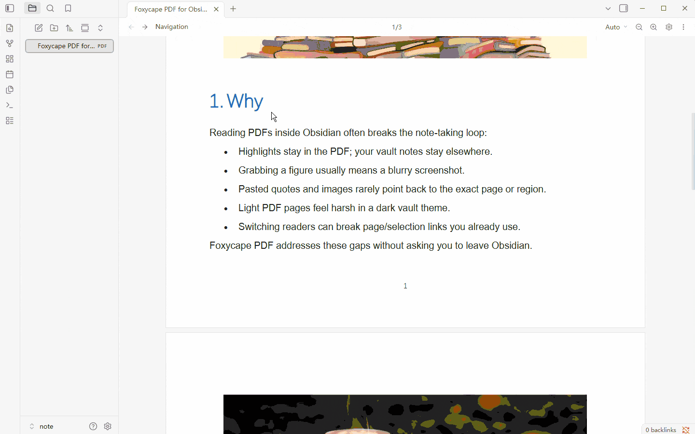
<!-- GIF: docs/gifs/highlight-notes.gif — highlight creates/updates a sidecar note -->

### Extract embedded images

Skip blurry screenshots. Hover an embedded image (or use the touch control on mobile) to preview, copy, or download the original asset.

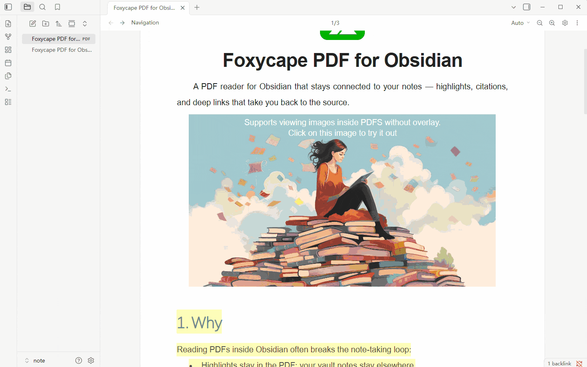
<!-- GIF: docs/gifs/embed-images.gif — hover lens: preview / copy / download -->

### Cite text and images, then jump back

Citations stay tied to the source, so you can jump back from the note later:

- Copy a text citation as Markdown with a deep link (`#page=` / `#selection=` / `#markId=`).
- Copy an image citation; paste into Markdown to save a PNG next to the PDF and insert a clickable link.
- Right-click the note image → **Open in Foxycape** to return to the page and highlight the original region.

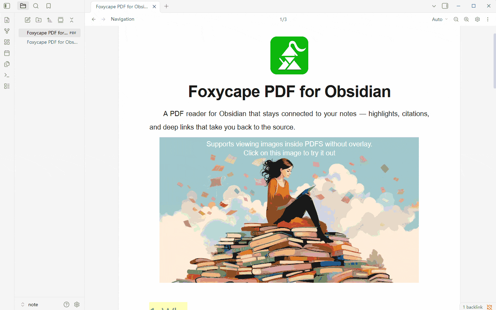
<!-- GIF: docs/gifs/cite-and-back.gif — copy cite → paste → open back in PDF -->

### Theme-aware PDF pages

Bright PDF pages can fight a dark vault. Optionally remap grayscale vector colors to your theme foreground/background (BETA) — for all themes, dark only, or light only. Color artwork stays as-is.

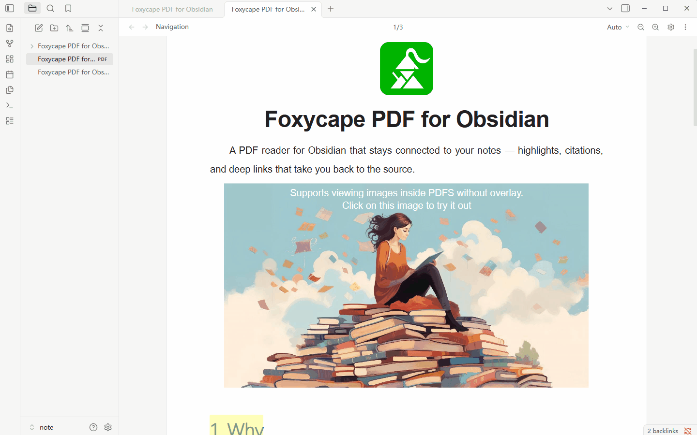

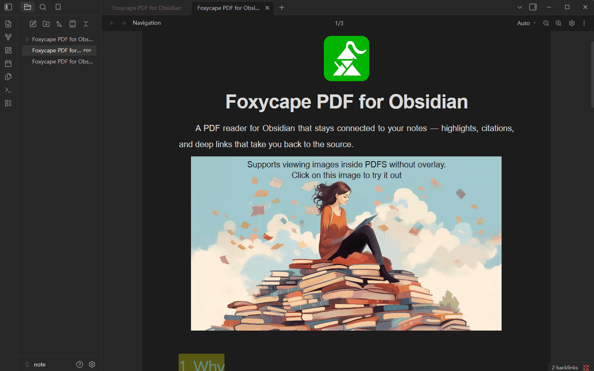
<!-- GIF: docs/gifs/theme-adapt.gif — PDF page follows Obsidian theme -->

### Compatible with Obsidian’s built-in PDF links

Switching readers shouldn’t break the links you already have. Foxycape understands Obsidian-style `#page=` and `#selection=`, can become the default PDF viewer, reuses an open tab when possible, and adds `#markId=` for precise highlight jumps.

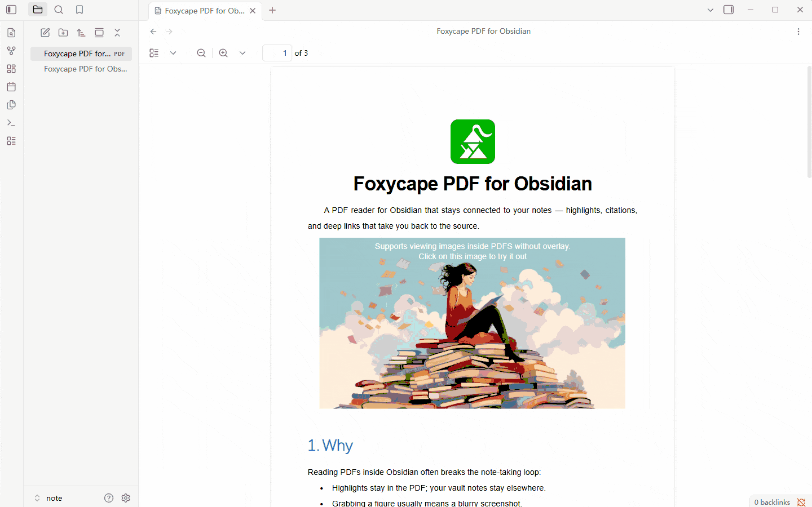
<!-- GIF: docs/gifs/compat-links.gif — open an existing page/selection link -->

### Highlights and highlight list

Highlighter, wavy underline, and straight underline with custom colors. Browse highlights in a list — filter, sort, jump, or delete.

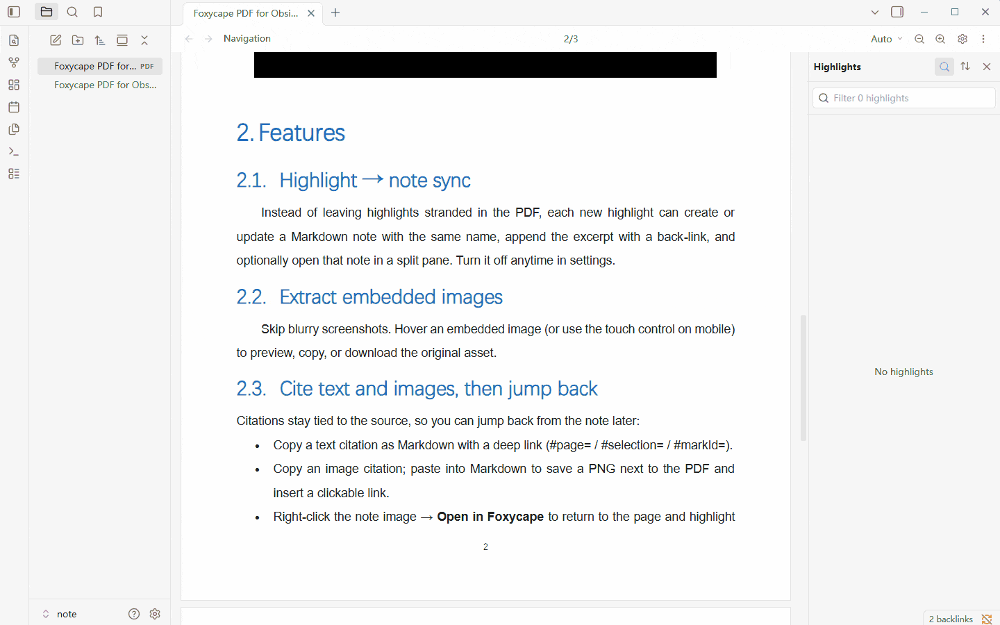
<!-- GIF: docs/gifs/annotations.gif — apply styles and browse the highlight list -->

### Smart copy — unwrap soft line breaks

PDF lines often insert hard breaks mid-sentence. Select text and copy as usual: Foxycape strips those soft wraps so the paste reads as continuous prose, while keeping real paragraph breaks.

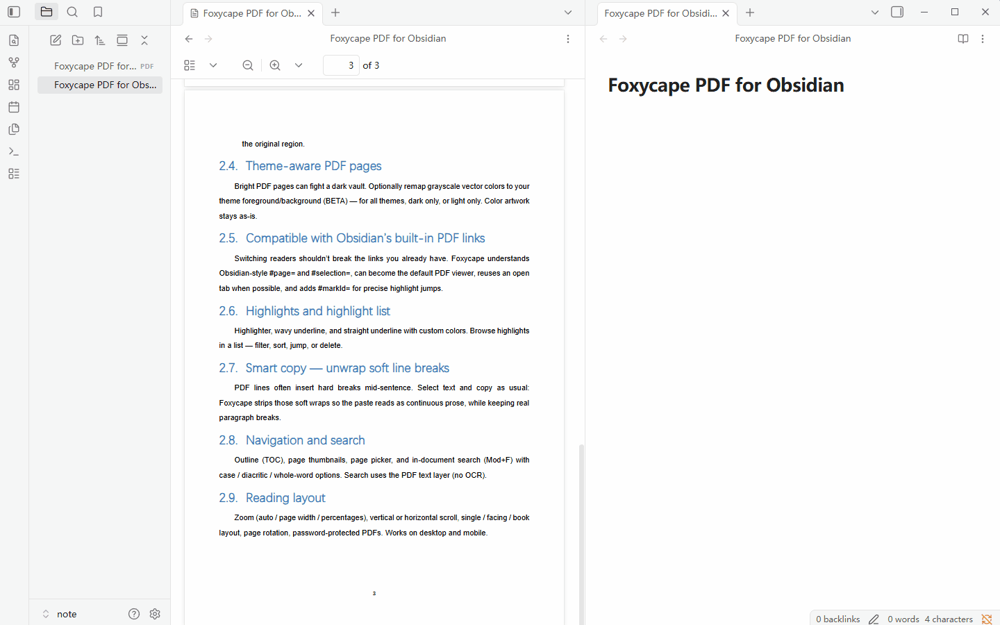
<!-- GIF: docs/gifs/smart-copy.gif — select text → copy → paste without mid-sentence newlines -->

### Navigation and search

Outline (TOC), page thumbnails, page picker, and in-document search (`Mod+F`) with case / diacritic / whole-word options. Search uses the PDF text layer (no OCR).

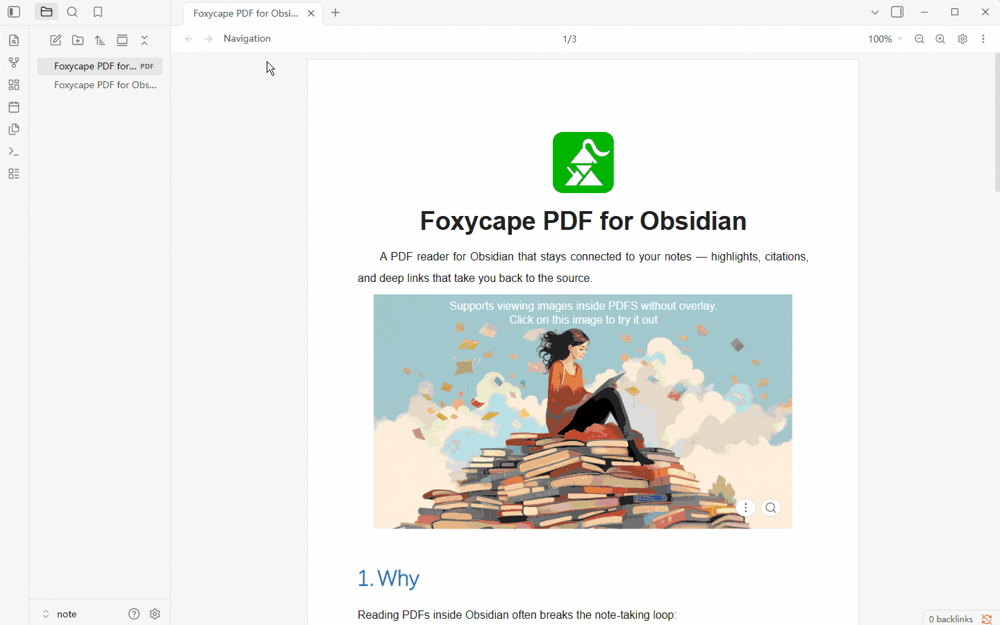
<!-- GIF: docs/gifs/navigate-search.gif — TOC, thumbnails, and search -->

### Reading layout

Zoom (auto / page width / percentages), vertical or horizontal scroll, single / facing / book layout, page rotation, password-protected PDFs. Works on desktop and mobile.

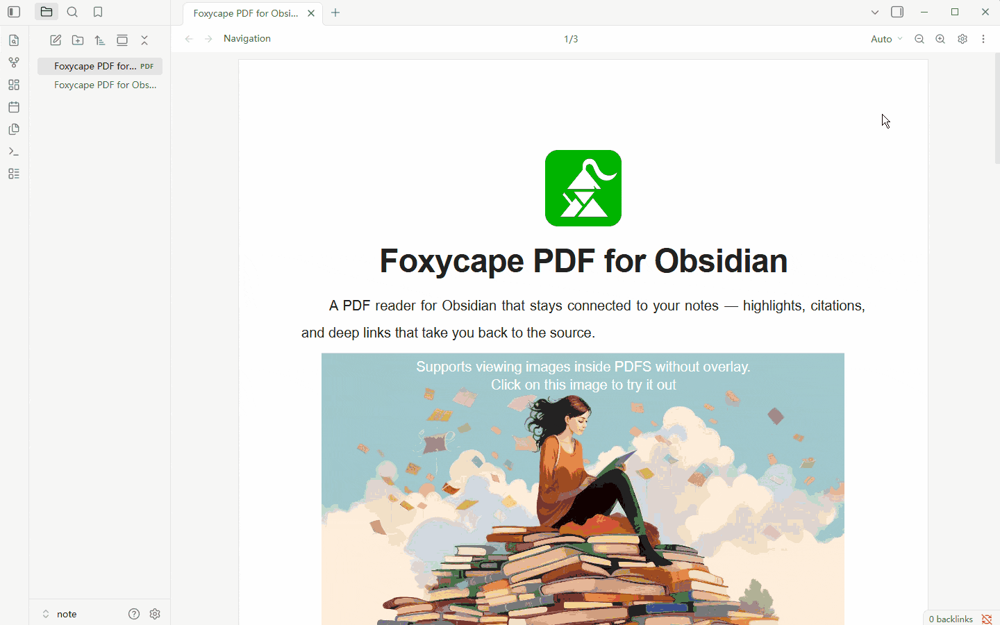

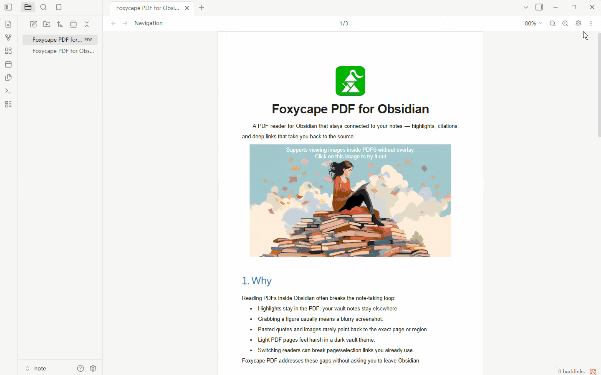
<!-- GIF: docs/gifs/layout.gif — layout and zoom controls -->

### Set as the default PDF reader

For the smoothest experience—deep links, highlights, and theme-aware pages—turn on **Use as default PDF viewer** in Foxycape settings so Obsidian opens PDFs with Foxycape by default.

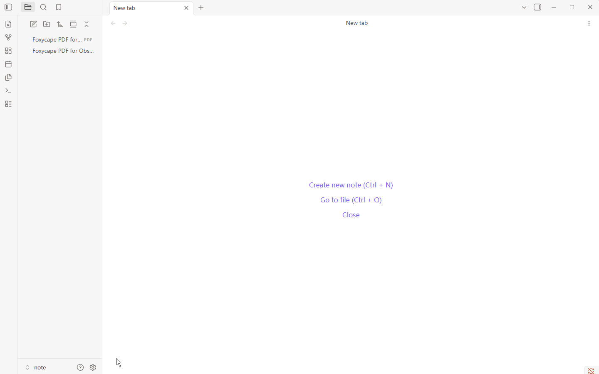
<!-- GIF: docs/gifs/set-default.gif — enable default PDF viewer in settings -->

## Develop

```bash
git submodule update --init --recursive   # if vendor/core is checked out as a submodule
npm install
npm run build      # → dist/main.js, styles.css, manifest.json + foxycape-pdf-assets.zip
npm run dev        # watch build (copies pdfjs/static sidecars into dist/)
npm test
npm run typecheck
npm run link       # junction dist/ into your vault's .obsidian/plugins/foxycape-pdf
```

Set `OBSIDIAN_PLUGIN_DIR` to override the vault plugin path used by `npm run link`.

Community installs only receive the three Obsidian files. On **first PDF open**, the plugin downloads `foxycape-pdf-assets.zip` (~3 MB: pdf.worker, cmaps, standard fonts) into the plugin folder. The cache is keyed by **PDF.js + signer identity**, not the plugin version, so routine plugin upgrades do not prompt again. Local `npm run link` already has those sidecars under `dist/`, so no download is needed.

## Release (Obsidian Community)

1. Bump `version` in `package.json` (semver `x.y.z`). Build syncs it into `manifest.json` / `versions.json`.
2. Commit, then create a GitHub release whose **tag equals that version** (e.g. `3.3.6`, no `v` prefix).
3. Attach `dist/main.js`, `dist/manifest.json`, `dist/styles.css`, and `dist/foxycape-pdf-assets.zip`.

Pushing a version tag runs [`.github/workflows/release.yml`](.github/workflows/release.yml), which builds and uploads those assets.

## License

This repository is **source available** under the [Foxycape Plugins License Agreement](LICENSE.md).

- You may use, modify, and redistribute the code, with a restriction on general-purpose competing Obsidian (or similar) offerings — including free public listings that strip trial/license controls.
- Private use, internal use within a single organization, and bespoke client-specific work remain allowed.
- For rights beyond that Agreement, see [pricing](https://www.foxycape.com/obsidian/pricing) or contact **company@tiefeiying.com**.

Third-party components (for example PDF.js) and separately published packages (for example `@foxycape/core` under MIT) keep their own licenses.

See [LICENSE.md](LICENSE.md) for the full text.
