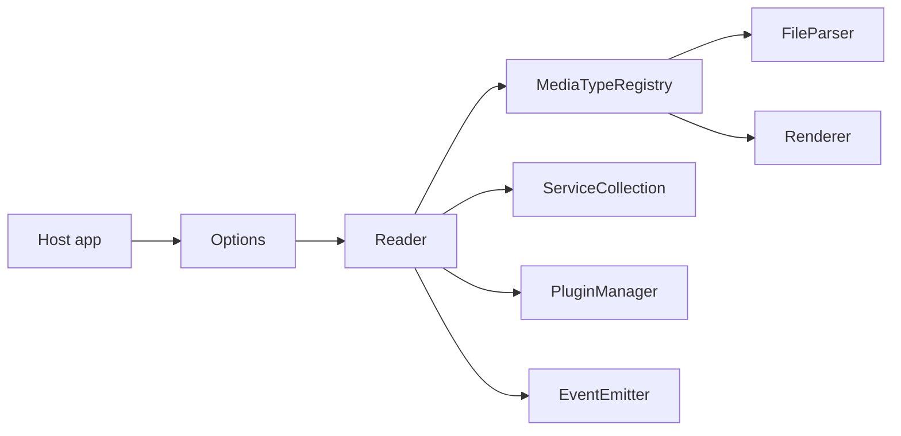

<div align="center">
  
  <h1>Foxycape Core</h1>
</div>

A browser-side multi-format reader kernel — one `Reader` API with pluggable parsers/renderers, services, and plugins for PDF, HTML, and more.

[English](README.MD) | [中文](README.zh.md)

## Overview

Foxycape Core (`@foxycape/core`) is a browser reader runtime you embed in your own app.

- **Includes**: the kernel under `kernal/` plus media implementations in `mediaTypes/html` and `mediaTypes/pdf`.
- **Does not include**: application chrome or product-specific UI — those belong in the host.

Public API barrel: `kernal/index.ts` (also `@foxycape/core` / `@foxycape/core/kernal`). Media implementations are imported by path (for example `@foxycape/core/mediaTypes/pdf/...`).

## Install

```bash
npm install @foxycape/core
```

```ts
import { Options, Reader } from '@foxycape/core'
import { PdfRenderer } from '@foxycape/core/mediaTypes/pdf/renderer/PdfRenderer'
```

Build the package before packing or publishing:

```bash
npm run build
```

## Features

### Unified open pipeline

Configure with `Options`, then open a document through `Reader.open(source, container, root, openOptions?)`. For parse-only / headless flows without a DOM host, use `FileLoader`.

### Pluggable media types

Register format support through `MediaTypeRegistry`:

```ts
reader.mediaTypeRegistry.register(
  ['.pdf'],
  async (url, extension) => /* FileParser */,
  async (owner, fileParser, el) => /* Renderer */,
)
```

PDF and HTML parsers/renderers ship under `mediaTypes/`. Samples show the registration pattern.

### Service injection

`ServiceCollection` lets hosts replace cross-cutting services such as HTTP, storage, loading UI, notifier, theme, and wallpaper providers:

```ts
reader.services.add('themeProvider', () => new HostThemeProvider())
```

### Plugin system

Extend interaction and behavior with `PluginCore`, register globally via `PluginRegistry`, and enable per reader instance through `PluginManager` (filtered by extension / language / version).

### Lifecycle hooks and events

Hook into load and render stages (`onInitialize`, `onFileParsed`, `onRenderer` / `onRenderered`, dispose hooks, and more). Subscribe to `EventNames` for page changes, progress, password prompts, theme changes, and related reader events.

### Mark contracts

`kernal/mark` defines `IMarker`, `Mark`, `MarkType`, and `ContentRange`. Core owns the contracts and shared geometry helpers; concrete mark engines usually live in the host.

### Navigation and theme

Paging, outline/nav points, reading progress, and theme/style provider interfaces keep layout and chrome concerns host-replaceable without forking the kernel.

## Architecture

```
.
├── kernal/        # Reader, FileLoader, services, plugins, mark contracts
├── mediaTypes/    # base / html / pdf parsers and renderers
├── samples/       # Vite demos (HTML & PDF)
├── tests/         # Vitest
└── pdfjs/         # Vendored PDF.js (relative imports)
```



Typical host flow:

1. `new Options()` → `new Reader(options)`
2. Register media types (and optionally services / plugins / lifecycle hooks)
3. `await reader.open(...)`

## Quick start

From the package root:

```bash
npm install
npm run sample:pdf
# or
npm run sample:html
```

Minimal integration sketch (see `samples/pdf/main.ts` for a full example):

```ts
import { Options, Reader } from '@foxycape/core'
// registerPdfMediaType(reader) — see samples/pdf/registerPdfMediaType.ts

const options = new Options()
options.enableHeader = false
options.enableFooter = false

const reader = new Reader(options)
// registerPdfMediaType(reader)

await reader.open(source, container, root, {
  extension: '.pdf',
  fileName: 'a.pdf',
})
```

## Development

| Script | Purpose |
|--------|---------|
| `npm run build` | Vite library build → `dist` |
| `npm run test` | Vitest once |
| `npm run test:watch` | Vitest watch |
| `npm run sample:html` | HTML reader demo |
| `npm run sample:pdf` | PDF reader demo |

PDF.js is vendored under `pdfjs/` and imported via relative paths from `mediaTypes/pdf/**`. The library build copies it into `dist/pdfjs`; the published npm package ships only `dist/` (including `dist/pdfjs`), not the source `pdfjs/` folder.

## License

Foxycape Core is licensed under the MIT License.

This package vendors [PDF.js](https://github.com/mozilla/pdf.js) (under `dist/pdfjs` after build), which is licensed under the Apache License 2.0. See `dist/pdfjs/LICENSE` in the published package (or `pdfjs/LICENSE` in the source tree).
