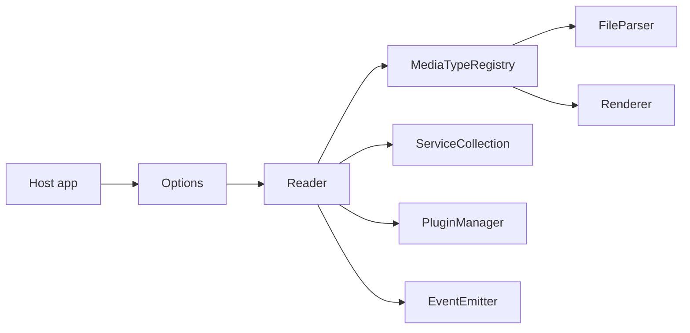

<div align="center">
  
  <h1>Foxycape Core</h1>
</div>

浏览器端多格式阅读器内核：统一 `Reader` API，通过可插拔解析器/渲染器、服务与插件承载 PDF、HTML 等格式。

[English](README.MD) | [中文](README.zh.md)

## 概述

Foxycape Core（`@foxycape/core`）是可嵌入自有应用的浏览器阅读器运行时。

- **包含**：`kernal/` 下的内核，以及 `mediaTypes/html`、`mediaTypes/pdf` 媒体实现。
- **不包含**：应用级 chrome 或产品专用 UI——这些由宿主自行实现。

公开 API barrel：`kernal/index.ts`（也可用 `@foxycape/core` / `@foxycape/core/kernal`）。媒体实现按路径导入（例如 `@foxycape/core/mediaTypes/pdf/...`）。

## 安装

```bash
npm install @foxycape/core
```

```ts
import { Options, Reader } from '@foxycape/core'
import { PdfRenderer } from '@foxycape/core/mediaTypes/pdf/renderer/PdfRenderer'
```

打包或发布前请先构建：

```bash
npm run build
```

## 特点

### 统一打开管线

用 `Options` 配置，再通过 `Reader.open(source, container, root, openOptions?)` 打开文档。无需 DOM 宿主的纯解析 / 无头场景，使用 `FileLoader`。

### 可扩展媒体类型

通过 `MediaTypeRegistry` 注册格式支持：

```ts
reader.mediaTypeRegistry.register(
  ['.pdf'],
  async (url, extension) => /* FileParser */,
  async (owner, fileParser, el) => /* Renderer */,
)
```

PDF 与 HTML 的解析器/渲染器位于 `mediaTypes/`。注册方式见 `samples/`。

### 服务注入

`ServiceCollection` 允许宿主替换横切服务，例如 HTTP、存储、加载 UI、通知、主题与壁纸提供者：

```ts
reader.services.add('themeProvider', () => new HostThemeProvider())
```

### 插件系统

用 `PluginCore` 扩展交互与行为，经 `PluginRegistry` 全局注册，再由 `PluginManager` 按扩展名 / 语言 / 版本在每个 Reader 实例上启用。

### 生命周期与事件

可在加载与渲染阶段挂接 hooks（`onInitialize`、`onFileParsed`、`onRenderer` / `onRenderered`、dispose 系列等）。通过 `EventNames` 订阅页码变化、进度、密码请求、主题变化等阅读器事件。

### 标注契约

`kernal/mark` 定义 `IMarker`、`Mark`、`MarkType`、`ContentRange`。Core 提供契约与共享几何工具；具体标注引擎通常由宿主实现。

### 导航与主题

分页、目录/导航点、阅读进度，以及主题/样式提供者接口，让布局与 chrome 可由宿主替换，而无需分叉内核。

## 架构

```
.
├── kernal/        # Reader、FileLoader、服务、插件、标注契约
├── mediaTypes/    # base / html / pdf 解析器与渲染器
├── samples/       # Vite demo（HTML & PDF）
├── tests/         # Vitest
└── pdfjs/         # 本地 vendored PDF.js（相对路径引用）
```



典型宿主流程：

1. `new Options()` → `new Reader(options)`
2. 注册媒体类型（以及可选的服务 / 插件 / 生命周期 hooks）
3. `await reader.open(...)`

## 快速开始

在包根目录下：

```bash
npm install
npm run sample:pdf
# 或
npm run sample:html
```

最小集成示意（完整示例见 `samples/pdf/main.ts`）：

```ts
import { Options, Reader } from '@foxycape/core'
// registerPdfMediaType(reader) — 见 samples/pdf/registerPdfMediaType.ts

const options = new Options()
options.enableHeader = false
options.enableFooter = false

const reader = new Reader(options)
// registerPdfMediaType(reader)

await reader.open(source, container, root, {
  extension: '.pdf',
  fileName: 'a.pdf',
})
```

## 开发

| 脚本 | 作用 |
|------|------|
| `npm run build` | Vite 库构建 → `dist` |
| `npm run test` | 运行 Vitest |
| `npm run test:watch` | Vitest watch |
| `npm run sample:html` | HTML 阅读器 demo |
| `npm run sample:pdf` | PDF 阅读器 demo |

PDF.js 以源码形式放在 `pdfjs/`，由 `mediaTypes/pdf/**` 通过相对路径引用。库构建会复制到 `dist/pdfjs`；发布到 npm 时只包含 `dist/`（含 `dist/pdfjs`），不包含源码树中的 `pdfjs/` 目录。

## 开源协议

Foxycape Core 采用 MIT 开源协议。

本包内嵌了 [PDF.js](https://github.com/mozilla/pdf.js)（构建后位于 `dist/pdfjs`），其许可证为 Apache License 2.0。详见发布包中的 `dist/pdfjs/LICENSE`（源码树中为 `pdfjs/LICENSE`）。
